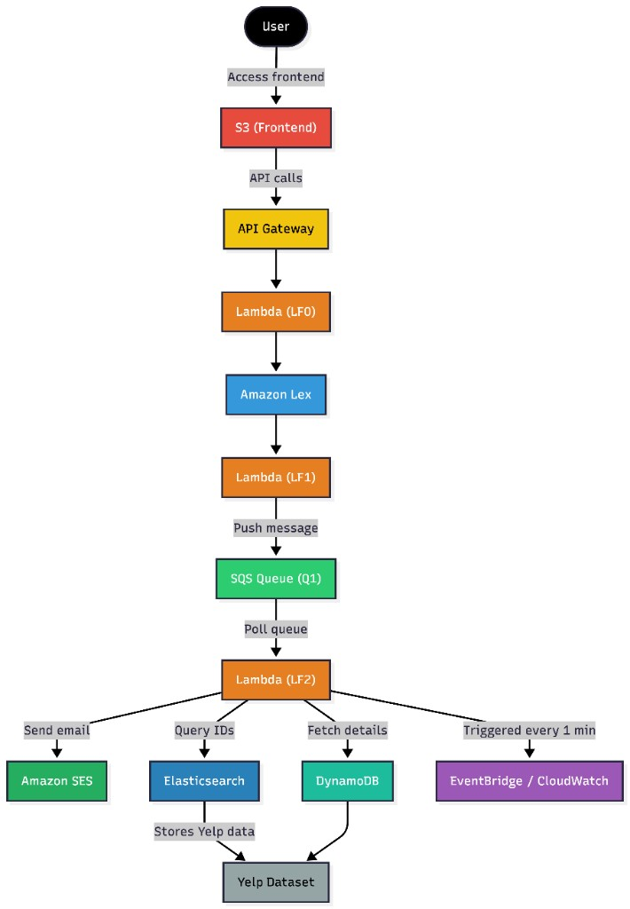

# 🍽️ Restaurant Suggestion Chatbot (AWS-Powered)

A cloud-based dining concierge chatbot built with serverless architecture on AWS. The system intelligently interacts with users to collect dining preferences and recommends restaurants via email using data from Yelp, DynamoDB, and Elasticsearch.

## 🏗️ Architecture

End-to-end flow: **User → S3 (static frontend) → API Gateway → Lambda LF0 → Amazon Lex → Lambda LF1 → SQS (Q1) → Lambda LF2**, with LF2 querying **Elasticsearch** (restaurant IDs / Yelp-backed index), **DynamoDB** (full restaurant details), sending mail via **SES**, and **EventBridge / CloudWatch** triggering LF2 on a schedule (e.g. every minute) to poll the queue.



*Optional — editable text version:* [`docs/architecture.mmd`](docs/architecture.mmd) (paste into [Mermaid Live Editor](https://mermaid.live) to tweak).

## 🧠 Features

- 🤖 Conversational chatbot powered by Amazon Lex
- 🌐 API Gateway + Lambda integration for chat messaging
- 🏙️ Yelp-sourced restaurant data stored in DynamoDB
- 🔎 Fast filtering using Elasticsearch index
- 📩 Restaurant suggestions sent via AWS SES
- 🕰️ EventBridge/Cron-based automated queue processing
- 💬 Web-based chat frontend hosted on S3

## 🧰 Technologies Used

- **Amazon Lex** – Conversational AI
- **Amazon SQS** – Message queue for async processing
- **Amazon SES** – Email delivery
- **Amazon DynamoDB** – NoSQL restaurant data store
- **Amazon Elasticsearch** – Quick lookup by cuisine
- **Amazon Lambda** – Serverless compute
- **Amazon API Gateway** – RESTful API endpoint
- **Amazon S3** – Frontend hosting
- **CloudWatch/EventBridge** – Scheduler for LF2

## 🗂️ Project Structure
```
.
├── cloud/
│   ├── frontend/                 # Static web interface
│   │   ├── chat.html             # Main chat page
│   │   └── assets/
│   │       ├── css/              # Styling (Bootstrap + custom)
│   │       └── js/               # Chat logic + AWS SDK / API Gateway SDK
│   ├── json/                     # Yelp data (raw, cleaned, bulk upload formats)
│   │   ├── restaurants_bulk_data.json
│   │   ├── yelp_restaurants.json
│   │   └── yelp_restaurants_cleaned.json
│   ├── lambda_functions/         # Lambda function scripts
│   │   ├── LF0.py                # API Lambda – frontend ↔ Lex
│   │   ├── LF1.py                # Lex hook – intent logic
│   │   └── LF2.py                # SQS worker – SES, ES, DynamoDB
│   └── other_scripts/
│       ├── clean_data.py
│       ├── yelp_fetch.py
│       ├── format_bulk_upload.py
│       └── upload_to_dynamodb.py
└── docs/
    ├── architecture-diagram.png  # Architecture figure (shown in README)
    └── architecture.mmd          # Optional Mermaid source for edits
```

## 🛠️ Setup Instructions

1. 🧠 Set up Lex bot and intents
2. 🛜 Deploy API Gateway using Swagger
3. 🔗 Connect LF0 Lambda to API
4. 💬 Deploy LF1 for Lex fulfillment
5. 📦 Run Yelp scraper and upload to DynamoDB + Elasticsearch
6. 📥 Configure LF2 to poll SQS and send emails
7. 📅 Schedule LF2 via EventBridge
8. 🌍 Upload frontend to S3 bucket and test live

## 🚀 Deployment Overview

### 1. Frontend Hosting
- Static site hosted via **Amazon S3**
- Uses Bootstrap and the API Gateway SDK for chat integration

### 2. Amazon Lex Chatbot
- **GreetingIntent**: Welcomes the user
- **ThankYouIntent**: Responds politely
- **DiningSuggestionsIntent**: Collects:
  - Location
  - Cuisine
  - Date
  - Time
  - Number of people
  - Phone/Email

- Uses **LF1 Lambda hook** to validate and push user input to **SQS Queue (Q1)**

### 3. API Gateway + LF0 Lambda
- Acts as an API wrapper between frontend and Lex
- Enables CORS
- Uses Swagger for definition

### 4. Data Collection & Storage
- Yelp scraping using `yelp_fetch.py`
- Store data in:
  - **DynamoDB (yelp-restaurants)** for full info
  - **Elasticsearch** for indexed search

### 5. Email Suggestions via LF2 Lambda
- Triggered by EventBridge (every minute)
- Pulls from SQS → fetches from Elasticsearch → joins with DynamoDB → sends via SES

## 🧪 Example Conversation

User: Hello  
Bot: Hi there, how can I help?

User: I need restaurant suggestions  
Bot: Got it. What city are you dining in?

User: Manhattan  
Bot: Great. What cuisine would you like?

User: Japanese  
Bot: How many people?

User: 2  
Bot: What date and time?

User: Today at 7 pm  
Bot: Please share your phone number or email for updates.

User: 123-456-7890  
Bot: You're all set! Expect restaurant suggestions shortly.

📧 Sample Email:

Hello! Here are my Japanese restaurant suggestions for 2 people, today at 7 pm:

1. Sushi Nakazawa — 23 Commerce St  
2. Jin Ramen — 3183 Broadway  
3. Nikko — 1280 Amsterdam Ave  

Enjoy your meal!

